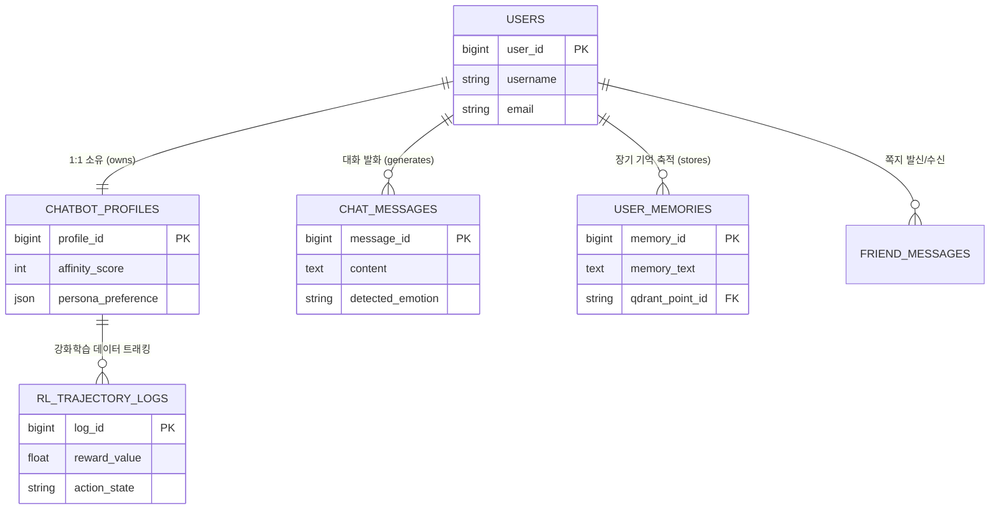

# 🤖 AI Buddy Project: 관계 지향형 개인화 AI 비서 서비스

> **"사용자의 감정을 학습하고 페르소나를 유지하며 교감하는 게임형 AI 비서 서비스"**  
> 단순 질의응답(Q&A)을 넘어, 사용자의 과거 대화와 감정을 기억하고 장기적인 관계를 형성하는 **개인화 AI 컴패니언 플랫폼**입니다.

---

## 📌 목차 (Table of Contents)
1. [프로젝트 개요 (Overview)](#-프로젝트-개요-overview)
2. [주요 기능 (Key Features)](#-주요-기능-key-features)
3. [기술 스택 (Tech Stack)](#-기술-스택-tech-stack)
4. [시스템 및 DB 아키텍처 (Architecture & ERD)](#-시스템-및-db-아키텍처-architecture--erd)
5. [기술적 핵심 및 성능 최적화 (Technical Highlights)](#-기술적-핵심-및-성능-최적화-technical-highlights)
6. [실험적 검증 및 회고 (Experiment & Retrospective)](#-실험적-검증-및-회고-experiment--retrospective)
7. [시작하기 (Getting Started)](#-시작하기-getting-started)

---

## 💡 프로젝트 개요 (Overview)

### 🎯 기획 배경 및 문제 정의
* **범용 LLM 서비스의 한계:** ChatGPT, Gemini 등 기존 챗봇은 일회성 정보 전달에 치중되어 유저 개개인과의 지속적인 관계 형성이나 장기적 몰입(Lock-in) 제공에 한계가 존재합니다.
* **정서적 커뮤니케이션의 장벽:** 프라이버시 문제 및 감정 교류의 부재로 유저가 고민이나 깊은 감정을 털어놓기 어렵습니다.

### 🚀 핵심 목표 및 차별화 요소
* **장기 기억(Long-term Memory) + 감정 보상(PPO):** 과거 대화 맥락과 유저의 감정 상태를 축적하여 맞춤형 대화를 전개합니다.
* **게이머빌리티(Gamification) 도입:** 호감도 시스템, 페르소나 인터랙션, 방 꾸미기 요소 등을 융합하여 과몰입 환경을 조성합니다.
* **모듈형 확장 구조 (B2B Expansion):** 연구용 시제품을 넘어 브랜드 챗봇, 교육 멘토, 헬스케어 케어봇 등으로 즉각 전환 가능한 모듈형 아키텍처를 설계했습니다.

---

## ✨ 주요 기능 (Key Features)

| 기능 | 상세 설명 |
|---|---|
| **🎭 게임형 페르소나 엔진** | 유저와의 상호작용 및 대화 양상에 따라 **호감도 점수(`affinity_score`)가 변동**하며, 말투와 행동 패턴이 동적으로 변화 |
| **🧠 하이브리드 장기 기억 (RAG)** | 유저의 중요 정보 및 대화 서사를 **PostgreSQL(RDB)**과 **Qdrant(Vector DB)**에 이원화하여 효율적 추출 |
| **📈 PPO 강화학습 보상 루프** | 대화 시 유저의 감정(행복, 분노, 혐오 등)을 실시간 분석하여 AI 에이전트를 가치 정렬(Alignment)하는 학습 파이프라인 |
| **💌 페르소나 기반 쪽지 라우팅** | 유저 간 메시지 송수신 시, 수신자의 AI 비서가 캐릭터 페르소나 어조로 문장을 가공하여 전달하는 오프라인 릴레이 기능 |
| **🌐 다국어 인터셉터 (i18n)** | 백엔드의 고도화된 한국어 NLP 연산을 유지하면서, 입출력단에서 타겟 언어(ko, en, ja)로 일괄 배치 번역 처리 |

---

## 🛠 기술 스택 (Tech Stack)

### Backend & Database


### AI & Vector Engine


### Environment & Tools


---

## 📐 시스템 및 DB 아키텍처 (Architecture & ERD)

### 🗄️ Database ERD (Mermaid)



---

## ⚡ 기술적 핵심 및 성능 최적화 (Technical Highlights)

### 1. N+1 문제 해소 및 배치(Batch) 라우팅
* **문제:** 미열람 쪽지 다건 조회 시, 각 메시지마다 LLM API를 반복 호출하여 응답 지연($Latency$) 및 토큰 비용 폭증 발생.
* **해결:** `process_friend_messages_in_batch` 단일 배치 아키텍처로 전환하여 외부 API 통신 횟수를 **O(N)에서 O(1)로 단축**하고 `id__in` 기반 단일 Bulk Update로 DB 부하 최적화.

### 2. 세션 기반 Micro-batch PPO Trajectory 버퍼링
* **문제:** 대규모 강화학습 모델의 실시간 추론/학습 시 인프라 자원 소모 극대화.
* **해결:** 유저 세션 내에 `ppo_trajectory` 버퍼를 두고 `TRAJECTORY_LENGTH_FOR_LEARNING = 5` 주기로 온라인 마이크로 배치를 형성해 안정적으로 `rl_agent.learn()` 호출.

---

## 🔬 실험적 검증 및 회고 (Experiment & Retrospective)

* **오픈소스 LLM(LG EXAONE) LoRA 파인튜닝 실험:**
  * 팀원 대화 데이터셋 수집 → 텍스트 정규화/토크나이징 → PEFT/LoRA 파라미터 효율적 학습 실시.
  * **트레이드오프 분석:** 온프레미스 인프라 한계 및 추론 속도 방어를 위해 최종 서빙 모델로 **GPT-4.1 mini**를 채택하였으나, 데이터 전처리부터 LoRA 파인튜닝 파이프라인 전체를 엔드투엔드로 직접 다뤄보며 기술적 자립 기반 확보.

---

## 🚀 시작하기 (Getting Started)

### 1. Repository Clone & Environment
```bash
git clone https://github.com/your-username/aibuddy_project.git
cd aibuddy_project
python -m venv venv
source venv/bin/activate  # Windows: venv\Scriptsctivate
pip install -r requirements.txt
```

### 2. Environment Variables (.env)
```env
DJANGO_USE_SQLITE=True
SECRET_KEY=your_django_secret_key
OPENAI_API_KEY=your_openai_api_key
QDRANT_HOST=localhost
QDRANT_PORT=6333
```

### 3. Database Migration & Run
```bash
python manage.py migrate
python manage.py runserver
```
